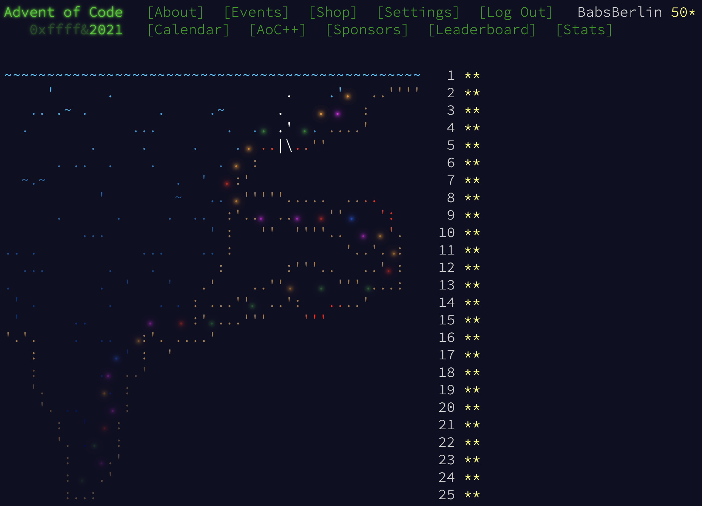
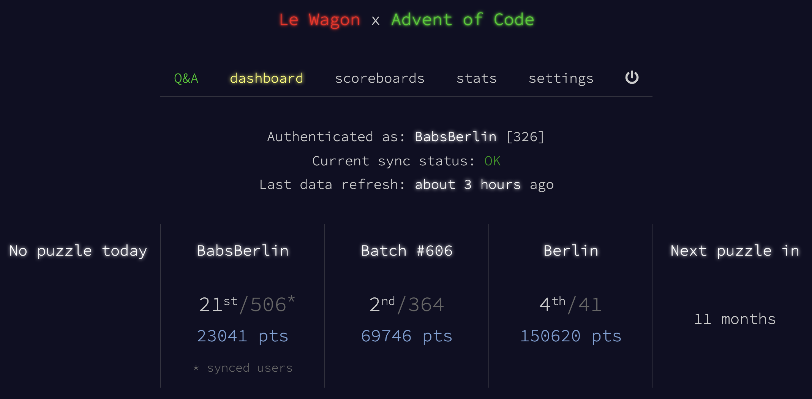

# Advent of Code 2021 🎄

I started with the goal to get further than last year, when I quit after day 8, thanks to our amazing community at Le Wagon and the motivation of my batch mates F and D I was able to finish all puzzles. 

I tried to publish as much as I can here, but most files are still a mess, which just happens when you have a new timely challenge every day for 25 days straight. And some code here could use some refactoring as well, I'll try to polish everthing up before Dec 2022 🎄

for those who do not know what this is:
[Advent of Code](https://adventofcode.com/2021/)

